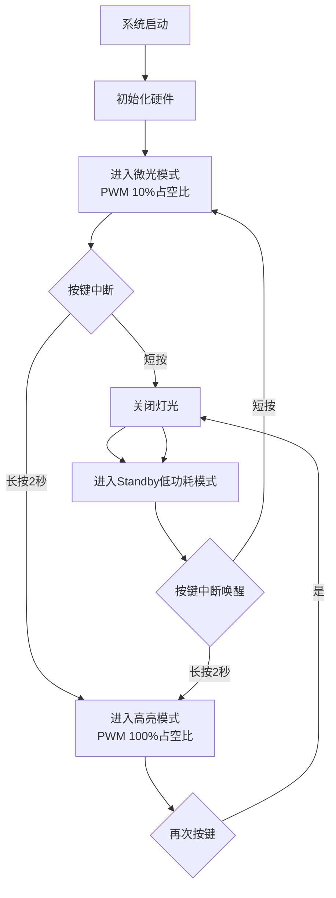

# 床头小夜灯项目

## 项目概述

这是一个基于STM32G030XX微控制器的床头小夜灯项目，具有闹铃功能。设备可以通过按键控制灯光亮度，并在设定的时间触发闹铃。

## 功能需求

### 灯光控制功能

1. **按键短按**：唤醒程序, 进入微光模式, 微光亮10分钟后.熄灭,进入低功耗模式.
2. **按键长按**：按住按键2秒，进入高亮模式, 不进入低功耗模式.
3. **再次按键**：微光模式或高亮模式, 按下按键, 进入低功耗模式.

### 低功耗
低功耗用StandBy模式, 注意机遇StandBy模式思路来开发.

### 硬件配置
PA0, 默认下拉. 
PA4, 灯光A.
PA7, 灯光.暂时不用实现
PA6, 蜂鸣器,闹铃,暂时不用实现

## 实现说明

### 状态机设计
- **LIGHT_OFF**: 灯光熄灭状态，系统处于低功耗模式
- **LIGHT_DIM**: 微光模式，PWM占空比10%，10分钟后自动关闭
- **LIGHT_BRIGHT**: 高亮模式，PWM占空比100%，需要手动关闭

### 按键处理
- **短按检测**: 按键按下瞬间
- **长按检测**: 按键按下时间超过2000ms
- **按键消抖**: 通过软件延时和状态机处理

### 低功耗管理
- 使用STM32的Standby模式实现低功耗
- 通过PA0引脚的上升沿触发唤醒
- 唤醒后系统重新初始化

## 系统流程图

