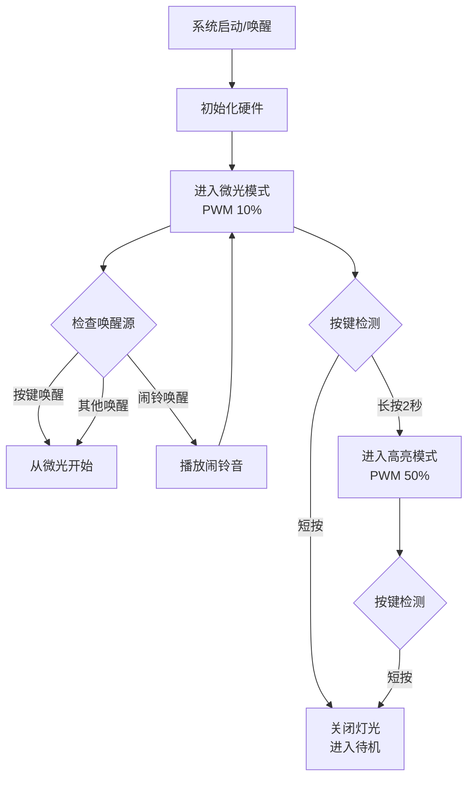

# 床头小夜灯项目

## 项目概述

这是一个基于STM32G030XX微控制器的床头小夜灯项目，具有RTC时钟和闹铃功能。设备可以通过按键控制灯光亮度，并支持串口命令配置时间和闹铃。

## 硬件配置

| 引脚 | 功能 | 说明 |
|------|------|------|
| PA0 | BIG_BTN | 按键输入，默认下拉，唤醒源 |
| PA4 | LEDA | 灯光控制PWM输出 (TIM14) |
| PA7 | LEDB | 灯光控制PWM输出 (TIM17) |
| PA6 | BEEP | 蜂鸣器PWM输出 (TIM16) |
| PA9/PA10 | USART1 | 串口通信 |

## 功能特性

### 灯光控制

- **微光模式**: PWM占空比10%，30分钟后自动关闭进入待机
- **高亮模式**: PWM占空比50%，需手动关闭
- **按键短按**: 关闭灯光并进入待机模式
- **按键长按2秒**: 从微光模式切换到高亮模式
- **防抖处理**: 灯亮超过1秒后才响应按键

### 低功耗管理

- 使用STM32的Standby模式实现低功耗
- 唤醒源:
  - PA0引脚上升沿 (按键唤醒)
  - RTC闹铃 (每日重复)
  - 其他唤醒源

### RTC时钟与闹铃

- 使用LSE晶振 (32768Hz)
- 支持串口命令设置时间、日期、闹铃
- 闹铃触发时播放提示音 (C5-E5-G5-C6-G5旋律)

### 串口命令

| 命令 | 说明 | 示例 |
|------|------|------|
| `TIME=HH:MM:SS` | 设置系统时间 | `TIME=07:30:00` |
| `DATE=YYYY-MM-DD` | 设置系统日期 | `DATE=2025-04-11` |
| `ALARM=HH:MM:SS` | 设置每日闹铃 | `ALARM=07:00:00` |
| `ALARM=OFF` | 取消闹铃 | `ALARM=OFF` |
| `BEEP=1` | 测试蜂鸣器 | `BEEP=1` |

## 系统流程



## 状态机

| 状态 | PWM占空比 | 超时 | 按键短按 | 按键长按 |
|------|----------|------|----------|----------|
| LIGHT_DIM | LEDA 0%, LEDB 10% | 30分钟 | 关闭+待机 | 切换到高亮 |
| LIGHT_BRIGHT | LEDA 50%, LEDB 10% | 无 | 关闭+待机 | 无效 |
| LIGHT_OFF | 0% | - | - | - |

## 文件结构

```
Core/Src/
├── main.c      # 主程序,包含状态机、串口命令处理
├── gpio.c      # GPIO配置,按键中断初始化
├── rtc.c       # RTC配置,闹铃中断回调
├── tim.c       # 定时器PWM配置
└── usart.c     # 串口配置

Core/Inc/
├── main.h      # 引脚定义,常量定义
├── rtc.h       # RTC头文件
└── ...
```

## 编译

```bash
mkdir build && cd build
cmake ..
make
```
