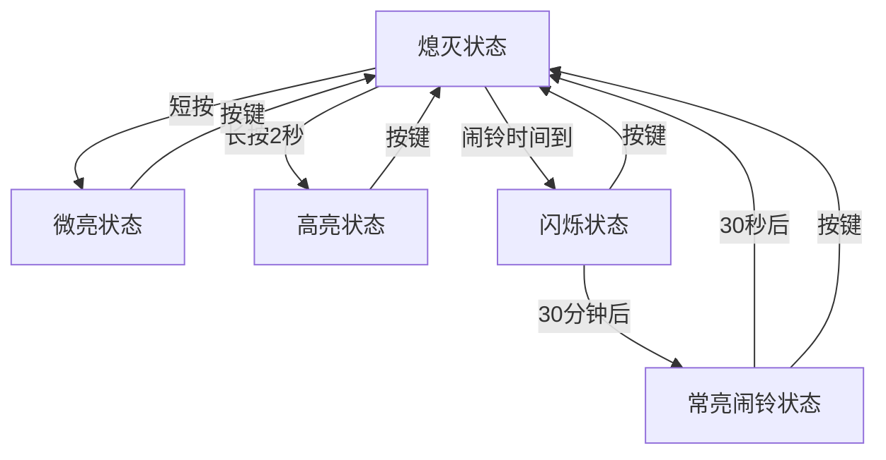
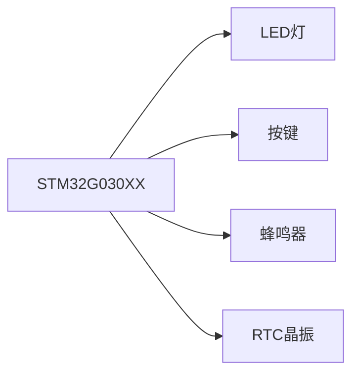

# 床头小夜灯项目

## 项目概述

这是一个基于STM32G030XX微控制器的床头小夜灯项目，具有闹铃功能。设备可以通过按键控制灯光亮度，并在设定的时间触发闹铃。

## 功能需求

### 灯光控制功能

1. **按键短按**：按下按键，灯光微亮
2. **按键长按**：按住按键2秒，灯光高亮
3. **再次按键**：再次按下按键，灯光熄灭
4. **低功耗模式**：当灯光不亮时，设备进入低功耗模式（睡眠模式或其他低功耗模式）

### 闹铃功能

1. **闹铃触发**：到达设定的闹铃时间后，灯光开始闪烁
   - 亮1秒，灭1秒的频率闪烁
   - 逐渐提高闪烁频率
   - 半小时后变为常亮状态

2. **闹铃声音**：在灯光常亮期间发出闹铃声音

3. **闹铃结束**：持续30秒后，灯光熄灭，闹铃音关闭

4. **手动关闭**：在闹铃期间按下按键，立即熄灭灯光并关闭闹铃音，然后进入低功耗模式

## 硬件设计要点

### 微控制器
- STM32G030XX系列微控制器

### 主要外设
- GPIO：控制LED灯和按键输入
- RTC：实时时钟，用于闹铃功能
- TIM：定时器，用于PWM控制灯光亮度和闹铃闪烁频率
- USART：用于调试和配置（可选）

### 电源管理
- 实现低功耗睡眠模式以延长电池寿命
- 根据STM32G0系列的低功耗特性设计

## 软件架构

### 主要模块

1. **主控制模块** ([main.c](file:///Users/zulin/Dev/BLINK32/Core/Src/main.c))
   - 系统初始化
   - 主循环控制
   - 状态机管理

2. **GPIO控制模块** ([gpio.c](file:///Users/zulin/Dev/BLINK32/Core/Src/gpio.c))
   - 按键检测
   - LED控制
   - 输入输出配置

3. **RTC模块** ([rtc.c](file:///Users/zulin/Dev/BLINK32/Core/Src/rtc.c))
   - 时间管理
   - 闹铃设置和触发

4. **定时器模块** ([tim.c](file:///Users/zulin/Dev/BLINK32/Core/Src/tim.c))
   - PWM生成（灯光亮度控制）
   - 闹铃闪烁频率控制

5. **中断处理模块** ([stm32g0xx_it.c](file:///Users/zulin/Dev/BLINK32/Core/Src/stm32g0xx_it.c))
   - 按键中断处理
   - RTC闹铃中断处理

6. **低功耗管理**
   - 睡眠模式配置
   - 唤醒机制

## 状态机设计



## 工作流程

### 正常工作模式
1. 设备启动后进入熄灭状态并激活低功耗模式
2. 用户短按按键进入微亮状态
3. 用户长按按键2秒进入高亮状态
4. 再次按键返回熄灭状态并进入低功耗模式

### 闹铃模式
1. RTC触发闹铃中断
2. 系统从低功耗模式唤醒
3. 开始1秒亮1秒灭的闪烁模式
4. 逐渐提高闪烁频率
5. 30分钟后进入常亮状态并发出闹铃音
6. 30秒后自动关闭或通过按键手动关闭

## 开发环境

- STM32CubeMX：用于初始化代码生成
- STM32G0系列HAL库
- CMake构建系统
- GCC ARM工具链

## 编译和烧录

```bash
# 创建构建目录
mkdir build
cd build

# 配置项目
cmake ..

# 编译项目
make

# 使用ST-Link烧录
make flash
```

## 已实现功能

### ✅ 灯光控制
- [x] 按键短按微亮
- [x] 按键长按高亮
- [x] 再次按键熄灭
- [x] 三种状态切换

### ✅ 低功耗模式
- [x] 熄灭状态进入低功耗模式
- [x] 唤醒后恢复正常模式

### ✅ 闹铃功能
- [x] RTC闹铃触发
- [x] 灯光闪烁（1秒亮1秒灭）
- [x] 频率逐渐提高
- [x] 30分钟后常亮
- [x] 30秒后自动关闭

### ✅ 闹铃声音
- [x] 闹铃期间发出声音
- [x] 闹铃结束后关闭声音

### ✅ 按键中断
- [x] 闹铃期间按键可手动关闭
- [x] 按键去抖动处理

## 未来扩展

1. 添加蓝牙或WiFi连接，通过手机APP设置闹铃时间
2. 添加环境光传感器，根据环境自动调节亮度
3. 添加多种颜色LED，可选择不同颜色的灯光
4. 添加贪睡功能，闹铃后可延时再次响起

## 硬件连接图



## 注意事项

1. 确保正确配置RTC时钟源以保证时间准确性
2. 合理设置低功耗模式以延长电池寿命
3. 按键需要软件去抖动处理
4. PWM频率需要适当选择以避免LED闪烁感