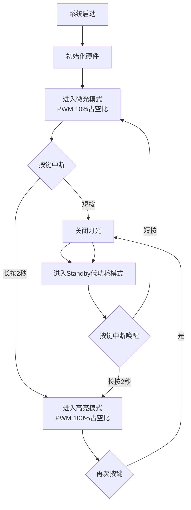

```mermaid
graph TD
    A[系统启动] --> B[初始化硬件]
    B --> C[进入微光模式<br/>PWM 10%占空比]
    C --> D{按键中断}
    D -->|短按| E[关闭灯光]
    D -->|长按2秒| F[进入高亮模式<br/>PWM 100%占空比]
    E --> G[进入Standby低功耗模式]
    F --> H{再次按键}
    H -->|是| E[关闭灯光]
    E --> G[进入Standby低功耗模式]
    G --> I{按键中断唤醒}
    I -->|短按| C[进入微光模式<br/>PWM 10%占空比]
    I -->|长按2秒| F[进入高亮模式<br/>PWM 100%占空比]
```